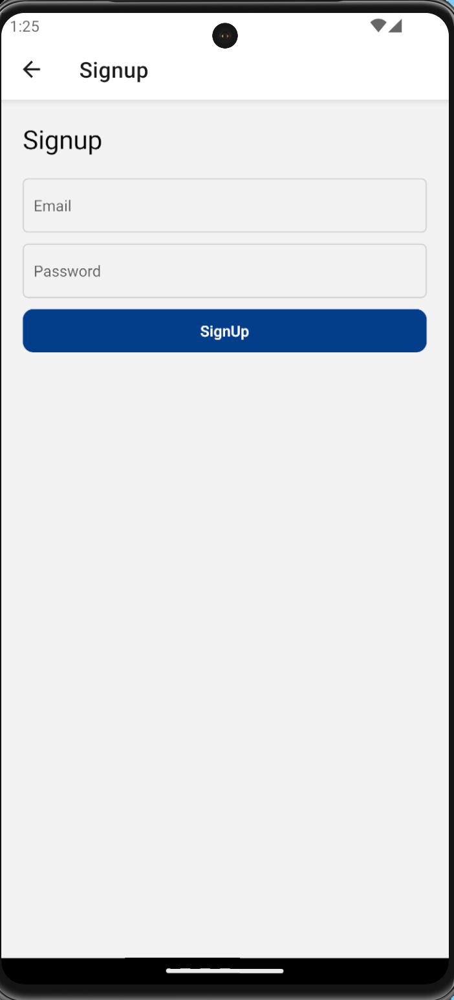

# RecipeApp

The project is developed in React-Native. It is a recipe app where you would find your favourite dish and its recipe.

# Key Features and concepts used
- Environment Variables used for sensitive data
- Authentication Persistence using Firebase's getReactNativePersistence 
- useState hook used for managing component-level state effectively
- Navigation is implemented using @react-navigation/native along with createNativeStackNavigator for seamless user experience.
- Firestore serves as the primary database for storing recipe data securely.
- Firebase is seamlessly integrated for both authentication (auth) and database (db) functionalities.
- Firebase configuration is securely set up using environment variables, ensuring the safety of sensitive data.

  

